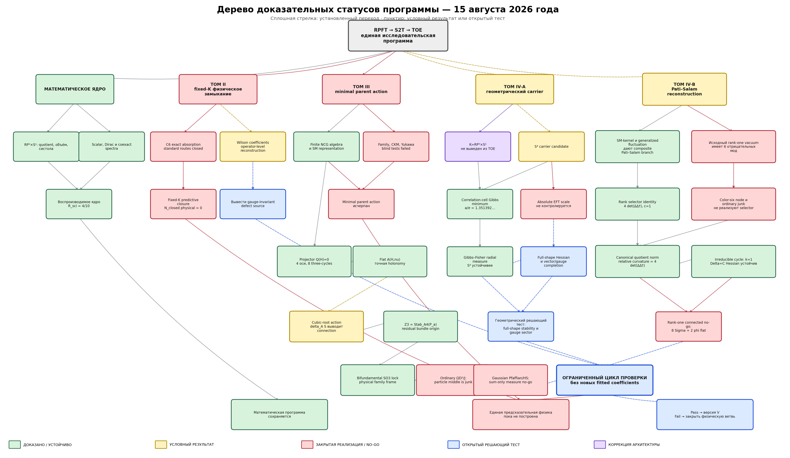

# Project Evidence-Status Tree

> Status: working
> Research status: current visual status map
> Type: synthesis
> Updated: 2026-08-15

## Legend

- Green: proved or reproducibly stable mathematical structure.
- Yellow: conditional result or candidate mechanism.
- Red: tested implementation closed negatively.
- Blue: open decisive test.
- Purple: architecture correction that changes interpretation.

## Reading the tree

The mathematical core survives with `R_sci=4/10`. The fixed-carrier and
minimal-parent physical branches are closed with `N_closed physical=0`.
Version IV now has two separate conditional branches. The geometric branch
derives the correlation-cell minimum and Gibbs-Fisher radial measure but
still lacks the full-shape/gauge Hessian. The Pati-Salam branch derives the
rank selector `4 det(Delta Delta^dagger)`, fixes `c=1` and obtains a canonical
relative graph projector, while the physical relative parent action, mixed
Hessian and RG ledger remain open.

The diagram therefore retains the mathematical program and restricts the
physical program to a finite set of decisive tests without new fitted
coefficients.

## Sources

- `s2t/assets/fig_project_success_tree_v4_current_2026-08-15.png`
- `s2t/audits/generate_project_success_tree_v4.py`
- `s2t/results/project_success_tree_v4_results.json`
- `s2t/gates/version4_project_success_tree_gate.tex`